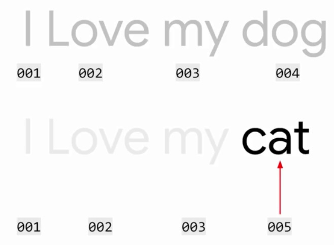
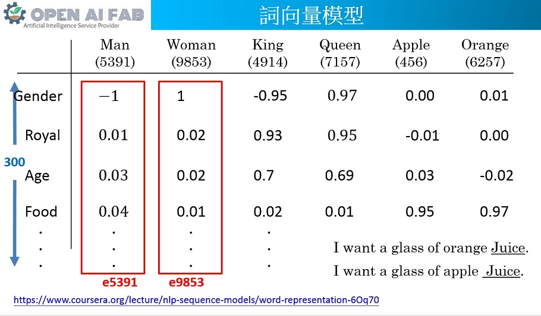
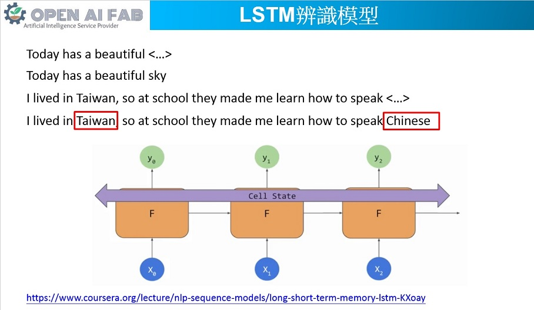
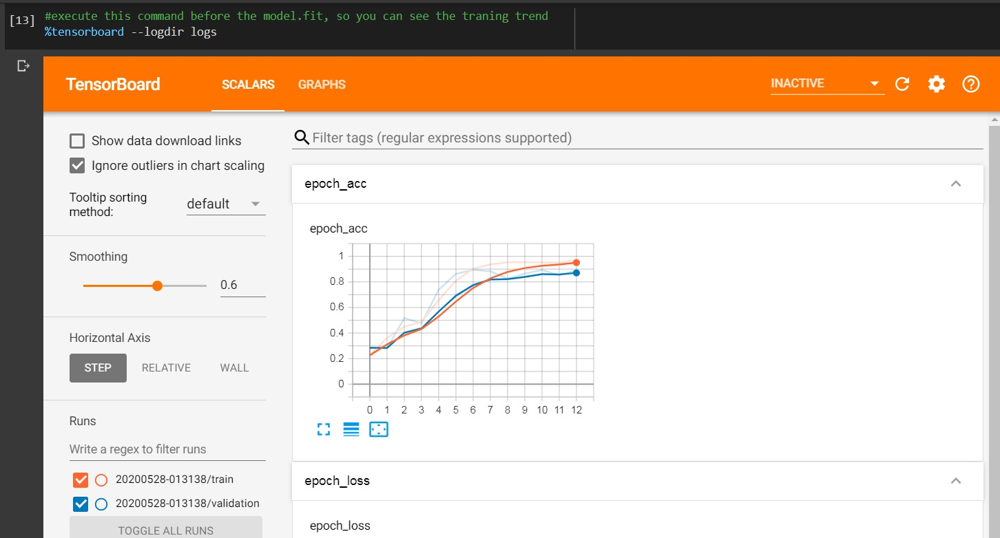
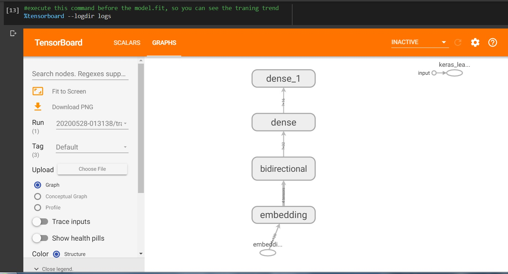
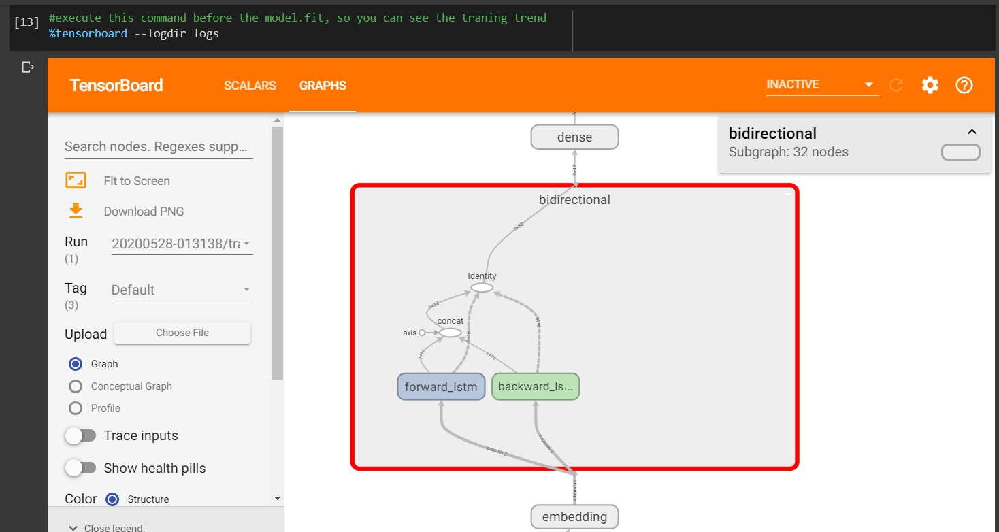

# NLP-LAB-for-training
用tensorflow和keras跑NLP的基礎教學，包含以下程式碼。  
### 1 Tokenizer pad_sequence.ipynb
此範例說明如何將句子的單字tokenize，並且把所有句子做padding讓長度相同。  
  
### 2 word embedding.ipynb
此範例說明如何對句子裡的單字做詞向量(word embedding)處理，再做訓練。  
  
### 3 Multi-class classification_BBC news_LSTM.ipynb
此範例說明如何使用LSTM做為model來訓練，範例為multi-class的新聞分類。  
  
#### 另外說明如何使用TensorBoard  
在Colab要先呼叫tensorboard，設定存Log檔的資料夾，方法如下：  
```python
# Load the TensorBoard notebook extension
%load_ext tensorboard
import datetime, os
logdir = os.path.join("logs", datetime.datetime.now().strftime("%Y%m%d-%H%M%S"))
tensorboard_callback = tf.keras.callbacks.TensorBoard(logdir)
```
在執行model.fit開始訓練前，先執行以下指令，就可以在訓練過程中觀察訓練狀況。  
```python
#execute this command before the model.fit, so you can see the traning trend
%tensorboard --logdir logs
```
在model.fit參數裡記得設定callbacks。    
```python
history = model.fit(..... ,callbacks=[tensorboard_callback])
```
TensorBoard在訓練開始前因為沒有資料，所以會一片空白，開始訓練後即有走勢圖可以觀察。TensorBoard預設每30秒更新一次，也可以自己按右上角更新按鈕。  
  
GRAPHS標籤頁可以看模型結構圖。  
  
對方塊點2下可以展開看到更多的細節。  
  
### 4 Pretrained embedding.ipynb
此範例說明如何使用pre-trained的詞向量(word embedding)來訓練自己的model，範例為2-class的好壞分類。  
### 5 Sequence models and literature.ipynb
此範例說明如何使用LSTM來生成文字，接續寫文章。  
## References
https://www.coursera.org/learn/natural-language-processing-tensorflow  
https://www.tensorflow.org/tensorboard/tensorboard_in_notebooks    
